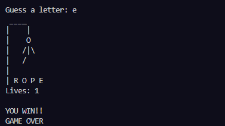

# Hangman Game in Python

Welcome to Hangman, a classic word-guessing game implemented in Python!

## Description

Hangman is a word puzzle game where the player tries to guess a hidden word by suggesting letters within a certain number of attempts. Each incorrect guess results in part of a "hangman" being drawn. The game continues until the player guesses the word correctly or runs out of attempts.

## Features

- Randomly selects a word for the player to guess.
- Keeps track of the number of incorrect guesses and displays the hangman.
- Provides feedback on the current state of the word, showing correctly guessed letters and placeholders for unrevealed letters.
- Allows the player to input letter guesses.

- For now, the game is played in the Terminal. In the future I plan on making a custom GUI for it.

This project was developed with the intent to practice and enhance my programming skills, particularly in handling conditionals, loops, and user input. Implementing the game's logic involves a variety of conditional statements, making it a valuable exercise for improving problem-solving abilities.

Enjoy the game and happy guessing!